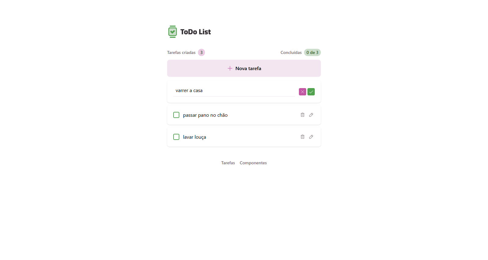

# 📝 Todo List - React

Aplicação de lista de tarefas (To-Do List) desenvolvida em **React**, com o objetivo de praticar e aprofundar os conhecimentos adquiridos durante o curso da Rocketseat.

Este projeto foi criado como parte do meu processo de aprendizado, focando na aplicação prática dos conceitos fundamentais do ecossistema React.

---

## 🚀 Sobre o projeto

A aplicação permite ao usuário gerenciar suas tarefas do dia a dia de forma simples e intuitiva, incluindo funcionalidades como:

- ✅ Adicionar novas tarefas
- ✏️ Marcar tarefas como concluídas
- 🗑️ Remover tarefas
- 📊 Acompanhamento do progresso (tarefas concluídas vs pendentes)

Projetos de To-Do são amplamente utilizados como base de aprendizado, pois permitem praticar conceitos essenciais como estado, componentização e manipulação da interface :contentReference[oaicite:0]{index=0}.

---

## 🛠️ Tecnologias utilizadas

- React
- TypeScript
- Vite
- Tailwind 

---

## 📚 Aprendizados

Durante o desenvolvimento deste projeto, foram trabalhados conceitos importantes como:

- Componentização
- Gerenciamento de estado (`useState`)
- Manipulação de eventos
- Renderização condicional
- Boas práticas de organização de código

A formação da Rocketseat é focada justamente na prática com projetos reais, ajudando a consolidar o aprendizado e preparar para o mercado :contentReference[oaicite:1]{index=1}.

---

## 💻 Como executar o projeto

```bash
# Clone o repositório
git clone https://github.com/HenryMiles02/todo-react

# Acesse a pasta
cd todo-react

# Instale as dependências
npm install

# Execute o projeto
npm run dev
```

---

## 📸 Preview



---

## 🎯 Objetivo

Este projeto tem como principal objetivo:

- Consolidar conhecimentos em React
- Praticar conceitos fundamentais do front-end
- Servir como peça de portfólio

---

## 📌 Melhorias futuras

 - Persistência de dados (API)
 - Filtros (todas, concluídas, pendentes)
 - Responsividade aprimorada
 - Testes automatizados

---

## 📄 Licença

Este projeto foi desenvolvido para fins educacionais e de portfólio.

---

## 👨‍💻 Autor

Desenvolvido por **Carlos Henrique**
